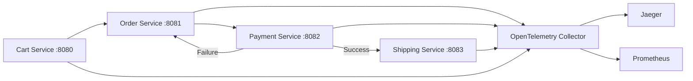

# Multi-Service OpenTelemetry Distributed Tracing Example

This project demonstrates distributed tracing using OpenTelemetry across a 4-service microservice architecture. It is a followup to the article: [The Evolution of Telemetry Standards](https://www.codemesh.dev/#/post/opentelemetry-evolution) and accompanies the lab guide [Building a Distributed Tracing Lab](https://www.codemesh.dev/#/post/opentelmetry-lab).

## Architecture



**Service Flow**:
1. **Cart Service** receives checkout request
2. **Order Service** creates order and calls Payment Service
3. **Payment Service** processes payment (50% success rate)
4. If payment succeeds → **Shipping Service** creates shipment
5. If payment fails → Order marked as PAYMENT_FAILED, shipping is skipped

All services are auto-instrumented with OpenTelemetry Java agent for distributed tracing.

## How to Run

### Build and Start All Services
```bash
docker-compose up --build --force-recreate --no-deps
```

In case there are no changes:
```bash
docker-compose up
```

## Services

| Service | Port | Description |
|---------|------|-------------|
| Cart Service | 8080 | Handles cart checkout |
| Order Service | 8081 | Orchestrates order processing |
| Payment Service | 8082 | Processes payments (50% success rate) |
| Shipping Service | 8083 | Creates shipments |
| Jaeger UI | 16686 | Distributed tracing visualization |
| Prometheus | 9090 | Metrics collection |
| Grafana | 3000 | Metrics visualization |
| OTEL Collector | 8889 | Metrics endpoint |

## Testing

### Manual Testing

**Success/Failure Test** (run multiple times to see both scenarios):
```bash
curl -X POST http://localhost:8080/api/cart/checkout \
  -H "Content-Type: application/json" \
  -d '{
    "items": ["laptop", "mouse"],
    "totalAmount": 99.99,
    "shippingAddress": "123 Main St, New York, NY 10001",
    "customerName": "John Doe"
  }'
```

**Expected Responses**:
- **Success**: Order created with tracking number
- **Failure**: Payment failed message, no tracking number

### Verification Guide

**1. Jaeger (Distributed Tracing)**
- **URL**: http://localhost:16686
- **Steps**:
  1. Select `cart-service` (or any other) in the "Service" dropdown.
  2. Click "Find Traces".
  3. Click on a trace to see the waterfall view of the request propagating through services.

**2. Prometheus (Metrics)**
- **URL**: http://localhost:9090
- **Steps**:
  1. Go to "Status" -> "Targets" to verify the OTEL collector is scraping targets.
  2. Go to "Graph".
  3. Enter a metric query like `http_server_requests_count_total` or `jvm_memory_used_bytes`.
  4. Click "Execute" to see the data.

**3. Grafana (Dashboard & Logs)**
- **URL**: http://localhost:3000
- **Credentials**: Login disabled (Anonymous Admin).
- **Verify Logs (Loki)**:
  1. Click "Explore" (compass icon in left sidebar).
  2. Select **Loki** from the datasource dropdown.
  3. Enter query: `{service_name="cart-service"}`.
  4. Click "Run query" to see application logs.
- **Verify Metrics**:
  1. Go to Dashboards (if provisioned) or Explore.
  2. Select **Prometheus** datasource.
  3. Query metrics to visualize performance.

**4. H2 Database Consoles**
- **Order DB**: http://localhost:8081/h2-console (`jdbc:h2:mem:orderdb`)
- **Payment DB**: http://localhost:8082/h2-console (`jdbc:h2:mem:paymentdb`)
- **Shipping DB**: http://localhost:8083/h2-console (`jdbc:h2:mem:shippingdb`)
- **Credentials**: User: `sa`, Password: `password`

## Key Features

- ✅ **Distributed Tracing** with OpenTelemetry auto-instrumentation
- ✅ **Context Propagation** across all services using W3C Trace Context
- ✅ **Conditional Service Calls** (shipping only called on payment success)
- ✅ **Error Handling** with proper trace status on failures
- ✅ **In-Memory Databases** (H2) with preloaded test data
- ✅ **50% Payment Success Rate** to demonstrate both success and failure paths
- ✅ **Proper POJOs** with validation annotations
- ✅ **Comprehensive Logging** with SLF4J

## Technology Stack

- **Framework**: Spring Boot 4
- **Language**: Java 25
- **Observability**: OpenTelemetry Java Agent
- **Tracing Backend**: Jaeger
- **Metrics**: Prometheus + Grafana
- **Logs**: Grafana Loki
- **Database**: H2 (in-memory)
- **Build Tool**: Maven
- **Container**: Docker + Docker Compose